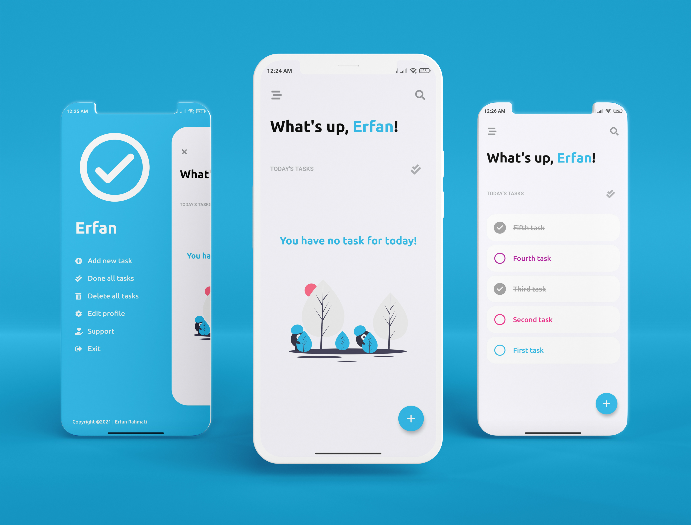
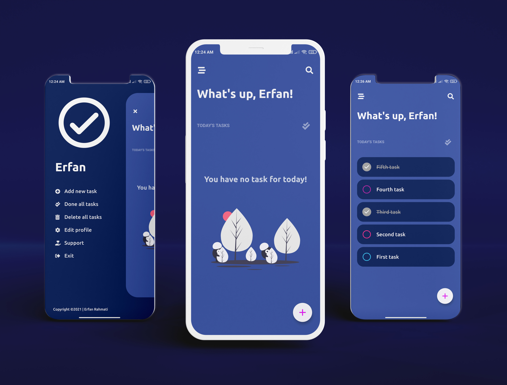

<p align="center">
  <h1 align="center">Tasker: To-Do List & Planner</h1>

  <p align="left">
    Tasker is an open source task manager (todo list) app, developed using Dart language and Flutter framework.
  </p>
  <p align="left">  
</p>

[](https://github.com/ErfanRht/Tasker/releases)

[](https://github.com/ErfanRht/Tasker/stargazers) 
[](https://github.com/ErfanRht/Tasker/network/members) 
[](https://github.com/ErfanRht/Tasker/issues) 
[](https://github.com/ErfanRht/Tasker/blob/master/LICENSE) 

<p align="center">
    
  &ensp;
    
  &ensp;
</p>

## Screenrecords

<p float="center">
  
  &ensp;
  
  &ensp;
</p>

## Download
  You can simply download it for Android from [Here](https://github.com/ErfanRht/Tasker/releases/tag/1.0.1).

## Contribute

I welcome contributions from the community! If you have an idea for an enhancement or have found a bug, you can raise a GitHub issue [here](https://github.com/ErfanRht/Tasker/issues) or you can follow these steps to contribute:

1. **Fork the repository**
2. **Create a new branch**
    ```sh
    git checkout -b feature/my-new-feature
    ```
3. **Commit your changes**
    ```sh
    git commit -am 'Add some feature'
    ```
4. **Push to the branch**
    ```sh
    git push origin feature/my-new-feature
    ```
5. **Create a new Pull Request**
   
## License
This project is licensed under the [Apache-2.0 License](https://github.com/ErfanRht/Tasker/blob/master/LICENSE).

## Author
This Flutter project is developed by [Erfan Rahmati](https://github.com/ErfanRht).

## Supporters
[](https://github.com/ErfanRht/Tasker/stargazers)
[](https://github.com/ErfanRht/Tasker/network/members)

---

<div align="center">

### Show some ❤️ by starring 🌟 the repository!

</div>
